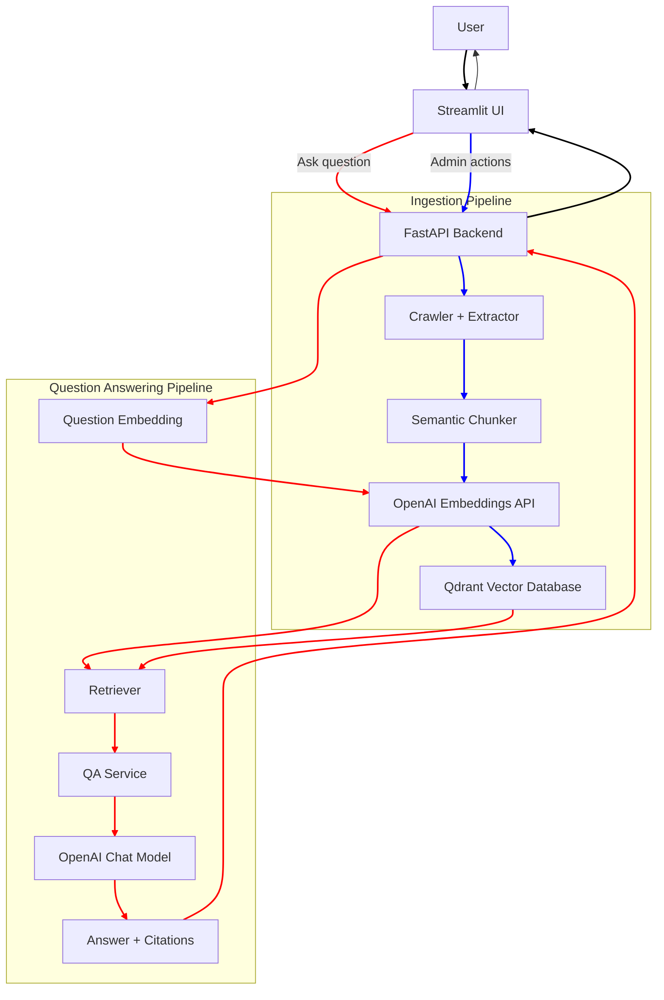
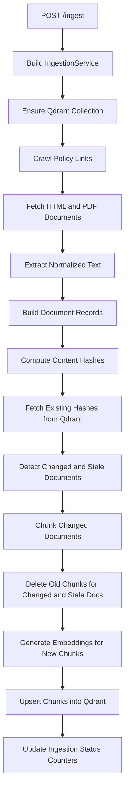
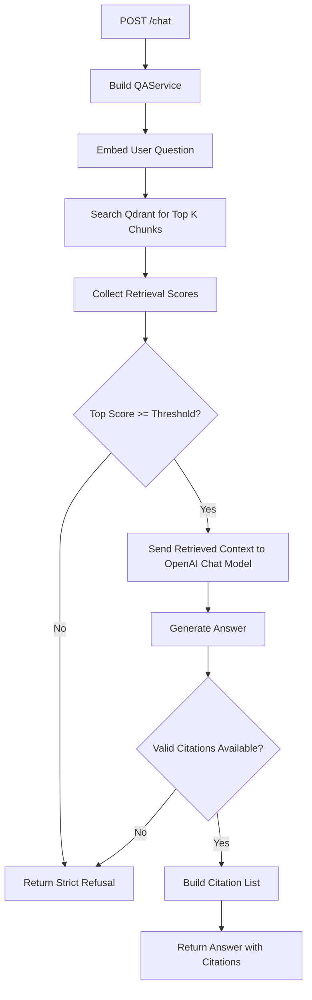
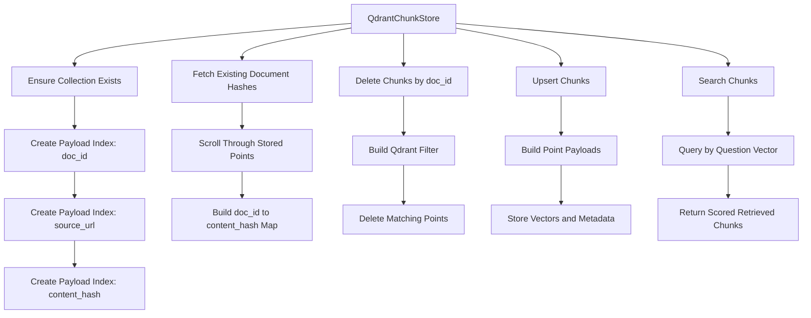
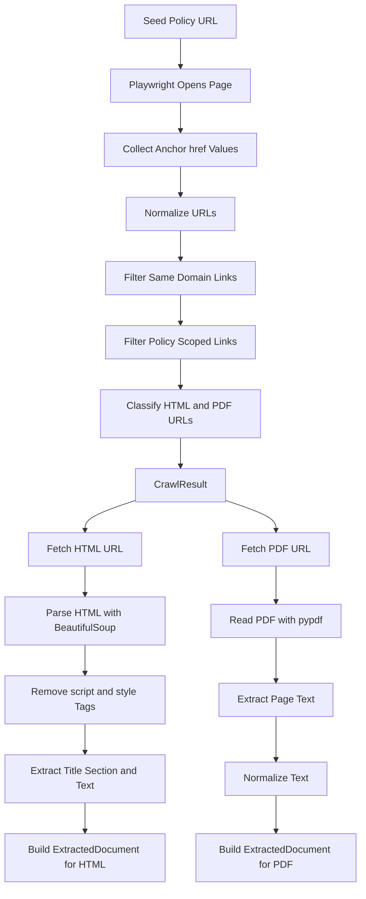

# Insurance Policy Chatbot

## Introduction

Insurance Policy Chatbot is a Retrieval-Augmented Generation (RAG) application built to answer questions from health insurance policy documents hosted on a provider website. The system crawls policy pages and linked PDFs, extracts the document content, splits the text into semantically useful chunks, generates embeddings for those chunks, stores them in Qdrant, and uses an LLM to answer user questions from retrieved evidence.

The project is designed to be strict about grounding. If the relevant answer is not supported by the indexed policy documents, the chatbot responds that it does not know rather than fabricating an answer. In case it finds the relevant answer, the chatbot also gives citations for the answer.

The system can crawl policy document website of any insurance provider and answer policy related questions for that insurance provider.

### Features

- Crawls policy content from a configured insurer policy URL using Playwright.
- Extracts text from both HTML pages and PDF documents.
- Chunks documents into retrieval-ready segments with deterministic document and chunk IDs.
- Generates embeddings with OpenAI and stores vectors in Qdrant.
- Supports incremental re-ingestion by detecting changed, unchanged, and stale documents.
- Retrieves the most relevant chunks for a user question before sending context to the LLM.
- Enforces strict refusal behavior when retrieval confidence is too low or supporting evidence is missing.
- Returns citations for non-refusal answers.
- Provides a Streamlit interface for chat, ingestion control, and ingestion status checks.
- Protects admin actions in the Streamlit UI with an admin password.

The app can be visited at: https://my-insurance-chatbot.streamlit.app/

## User Guide

### Ask Policy Questions

1. Open the Streamlit app.
2. Go to the `Policy Chat` section.
3. Enter your question in the text box.
4. Optionally adjust the `Retrieved chunks (top_k)` slider.
5. Click `Ask`.
6. Review the answer shown in the chat history.
7. If the answer is grounded in indexed policy content, review the citations shown below it.
8. If the system cannot find enough supporting evidence, it will respond that it does not know the answer based on the provided policy documents.

### Refresh Ingestion Status

1. Open the Streamlit app.
2. Go to the `Admin` section.
3. Expand `Ingestion`.
4. Enter the admin password in the `Admin password for status refresh` field.
5. Click `Refresh Ingestion Status`.
6. Review the returned status payload for the latest ingestion state and counters.

### Run Incremental Re-Ingestion

1. Open the Streamlit app.
2. Go to the `Admin` section.
3. Expand `Ingestion`.
4. Review the `Optional seed URL override` value and change it only if needed.
5. Enter the admin password in the `Admin password for re-ingest` field.
6. Click `Run Incremental Re-Ingest`.
7. Wait for the request to complete and review the returned response.
8. Use `Refresh Ingestion Status` afterward to confirm the latest counters and completion state.

## High Level Diagram

## Low Level Diagrams

### Ingestion Pipeline

### Retrieval and QA Pipeline

### Vector Store Interactions

### Crawler and Extraction Flow

## Architecture Notes

- `streamlit_app/app.py`
  - Implements the Streamlit user interface.
  - Handles chat requests, admin actions, and rendering of answers, citations, and ingestion status.

- `backend/app/main.py`
  - Exposes the FastAPI routes: `/health`, `/ingest`, `/ingest/status`, and `/chat`.
  - Builds and connects the ingestion and QA services.

- `backend/app/ingestion.py`
  - Orchestrates the incremental ingestion workflow.
  - Coordinates crawling, extraction, content hashing, chunking, embedding generation, stale chunk deletion, and vector upserts.

- `backend/app/crawler.py`
  - Discovers in-scope policy URLs using Playwright.
  - Filters links by domain and policy-related path rules, then separates HTML and PDF targets.

- `backend/app/extractor.py`
  - Extracts normalized content from HTML pages and PDF documents.
  - Produces `ExtractedDocument` objects used by later pipeline stages.

- `backend/app/chunker.py`
  - Splits extracted documents into token-aware chunks.
  - Generates deterministic document IDs and chunk IDs.

- `backend/app/embeddings.py`
  - Calls the OpenAI embeddings API for document chunks and user questions.

- `backend/app/vector_store.py`
  - Encapsulates all Qdrant operations.
  - Handles collection initialization, payload indexing, document hash lookup, chunk deletion, vector upsert, and retrieval.

- `backend/app/qa.py`
  - Implements retrieval-driven answer generation logic.
  - Applies retrieval threshold checks and citation enforcement before returning a response.

- `backend/app/llm.py`
  - Sends retrieved context to the OpenAI chat model.
  - Produces the final grounded answer text.

- `backend/app/config.py`
  - Loads application configuration from environment variables.
  - Centralizes runtime settings for backend, models, vector database, and admin controls.

## Project Limitations

- Crawling behavior depends on the structure and accessibility of the target insurer website.
  - Sites with aggressive bot protection, authentication redirects, or dynamic content restrictions may reduce ingestion reliability.

- The system is document-grounded only.
  - It does not use external domain knowledge beyond the indexed policy content.
  - If relevant information is not present in the ingested documents, the chatbot will refuse to answer.

- Retrieval quality depends on chunking quality, embedding quality, and the configured similarity threshold.
  - Some valid answers may still be refused if the most relevant chunks do not score above threshold.

- OpenAI API rate limits and quota limits can affect both ingestion and question-answering latency or success.

- The ingestion flow is currently synchronous.
  - Large re-ingestion runs may take time and can block the request until completion.

- Admin protection in the Streamlit app is password-based only.
  - It is suitable for basic control but is not a full authentication and authorization system.
